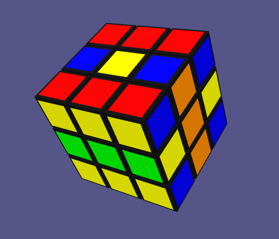

# Rubiks Cube in ThreeJS

* Clone the repo
* Run a static file server like 'superstatic' in the root folder, or open the index.html
* Or online [demo](https://ebinxavier.github.io/rubiksCube?order=3&&shuffle=4)
* You can play with `order` and `shuffle` parameters ot get different size cube and different shuffling counts.

The Rubik's Cube is a 3-D combination puzzle invented in 1974 by Hungarian sculptor and professor of architecture Ernő Rubik. Originally called the Magic Cube, the puzzle was licensed by Rubik to be sold by Ideal Toy Corp. in 1980 via businessman Tibor Laczi and Seven Towns founder Tom Kremer.

